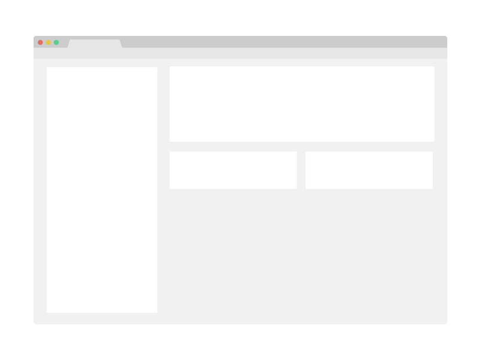

# Stand-up show 

> The webpage about the main Stand-up shows around the globe for 2021.

A simple web page developed within the Microverse curriculum, which contains/provides information about world class Stand-up comedians and their shows scheduled for 2021.

## Built With

- HTML/CSS/JavaScript

## Live Demo

[Live Demo Link](https://livedemo.com)

## Getting Started

### To see the live demo please click an the above link, to launch the project locally please follow the next steps:

To get a local copy up and running follow these simple example steps.

#### Step 1:
- Copy the link of this repo by clicking the green button - "code" on the right-top corner
- Clone this repo locally by running the following command in your terminal:

  git clone git@github.com:Hope1226/CAPSTONE-Stand-up-show-web.git

#### Step 2:
- Run index.html file in your browser
- The switch to Mobile version will occur at 750px (please, run browser toolbox and change view to mobile to review the mob version).

## Authors

👤 **Author1**

- GitHub: [@GitHub](https://github.com/githubhandle)
- Twitter: [@twitterhandle](https://twitter.com/twitterhandle)
- LinkedIn: [@LinkedIn](linkedin.com/in/umidjon-ustabaev-03b92b11a)

## 🤝 Contributing

Contributions, issues, and feature requests are welcome!

Feel free to check the [issues page](../../issues/).

## Show your support

Give a ⭐️ if you like this project!

## Acknowledgments

- Hat tip to anyone whose code was used
- Stand-up comunity

## 📝 License

This project is [MIT](licence/MIT.md) licensed.
